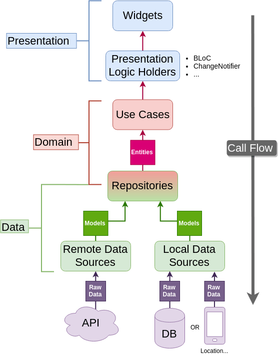

# Test Driven Development

In that `clean architecture`, there has `three layers`

- ## Domain
    - Entity
    - UseCases
    - Repository
- ## Data
    - Repository
    - DataSources
    - Model
- ## Presentation
    - Pages
    - StateManagement
    - Widgets



We have to start from `the domain layer.` The main is the inner layer and which shouldn't be
susceptible and will contain
only `The Core Business logic and business objects (Enterprise/System-wide business rules)`. The
domain layer should be `totally independent of every other layer`. It can make changes/additions
without interfering with rest of program even though it is a core layer.

Let's create the `Entity of the Domain layer`.

### Entity

**`Entity are business objects of an applications or a system - eg. Article, Blog,`**

```dart
// domain/entities/promo.dart
import 'package:equatable/equatable.dart';

// Abstract Business object
abstract class Promo extends Equatable {
  final String eventName;
  final String poster;
  final DateTime duration;

  const Promo({
    required this.eventName,
    required this.poster,
    required this.duration,
  });

  @override
  List<Object?> get props => [eventName, poster, duration];
}

```

### Repository

Repository is the bridge between `Domain layer` and `Data layer`. Actual implementations of
repositories is in the `Data layer`. Repositories are responsible for coordinating data from the
different data sources. The repository of the domain layer is in the form of an abstract class in
which there are functions that to be implemented.

You can also called `Business Logic method` and we will test it later.

```dart
// domain/repositories/promo_repository.dart

import '../entities/promo.dart';

// Abstract Business logic methods
abstract class PromoRepository {
  Future<Promo> getFavPromo();

  Future<Promo> getExpiryPromo();

  Future<void> saveFavPromo({required Promo promo});

  Future<void> delFavPromo({required Promo promo});
}

```

In the `repository of the Data Layer` that we will start implementing the abstract classes
of `repository of the Domain Layer`.

```dart
// data/repositories/promo_repository_impl.dart
import 'dart:async';

import '../../domain/entities/promo.dart';
import '../../domain/repositories/promo_repository.dart';
import '../data_sources/api_service.dart';
import '../models/promo_model.dart';

// Implemented Business logic methods
class PromoRepositoryImpl implements PromoRepository {

  @override
  Future<void> delFavPromo({required Promo promo}) async {
    throw UnimplementedError();
  }

  @override
  Future<void> saveFavPromo({required Promo promo}) async {
    throw UnimplementedError();
  }

  @override
  Future<PromoModel> getExpiryPromo() async {
    throw UnimplementedError();
  }

  @override
  Future<PromoModel> getFavPromo() async {
    throw UnimplementedError();
  }
}


```

## Model

In the implementing of repository, we need the response model. So, *let create promo model as the
same of promo entity.*

```dart
// data/models/promo_model.dart
import '../../domain/entities/promo.dart';

// Business object model
class PromoModel extends Promo {
  const PromoModel({
    required super.eventName,
    required super.poster,
    required super.duration,
  });
}


```

## Models Vs Entities

**`Why do we need a model and not use entity?`**

Because as we said before, the domain layer `must be independent` and not depend on other layers.
Example, when we want to change our database in the future data type or adding new properties and we
have to change the entity if
we use entity instead of model in the Data Layer. That is against the rule of Clean Architecture.

## Data Sources

`Service that provides the data we need like API service or Persistence service.`

```dart
// data/data_sources/api_service.dart

import 'package:flutter/foundation.dart';

import '../../domain/entities/promo.dart';
import '../models/promo_model.dart';

// Data Service to provide data from api source or persistence source or somewhere
class ApiService {
  Future<void> delFavPromo({required Promo promo}) async {
    await Future.delayed(const Duration(seconds: 10));
    if (kDebugMode) {
      print("del Fav Promo pass");
    }
  }

  Future<void> saveFavPromo({required Promo promo}) async {
    await Future.delayed(const Duration(seconds: 10));
    if (kDebugMode) {
      print("save Fav Promo pass");
    }
  }

  Future<PromoModel?> getExpiryPromo() async {
    await Future.delayed(const Duration(seconds: 10));
    if (kDebugMode) {
      print("get Expiry Promo pass");
    }
    return PromoModel(
      eventName: "eventName",
      poster: "promo",
      duration: DateTime.now(),
    );
  }

  Future<PromoModel?> getFavPromo() async {
    await Future.delayed(const Duration(seconds: 10));
    if (kDebugMode) {
      print("get Fav Promo pass");
    }
    return PromoModel(
      eventName: "expiryEventName",
      poster: "expiryPromo",
      duration: DateTime.now(),
    );
  }
}


```

And, use this data provided service in `implemented repository of the Data Layer` and combine with
your business logic.

```dart
// data/repositories/promo_repository_impl.dart

import 'dart:async';

import '../../domain/entities/promo.dart';
import '../../domain/repositories/promo_repository.dart';
import '../data_sources/api_service.dart';
import '../models/promo_model.dart';

// Implemented Business logic methods
class PromoRepositoryImpl implements PromoRepository {
  late ApiService _apiServices;

  PromoRepositoryImpl() {
    _apiServices = ApiService();
  }

  @override
  Future<void> delFavPromo({required Promo promo}) async {
    _apiServices.delFavPromo(promo: promo);
  }

  @override
  Future<void> saveFavPromo({required Promo promo}) async {
    _apiServices.saveFavPromo(promo: promo);
  }

  @override
  Future<PromoModel> getExpiryPromo() async {
    final promo = await _apiServices.getExpiryPromo();
    if (promo == null) {
      throw "There is an error to get expiry promo";
    }
    return promo;
  }

  @override
  Future<PromoModel> getFavPromo() async {
    final promo = await _apiServices.getFavPromo();
    if (promo == null) {
      throw "There is an error to get Fav promo";
    }
    return promo;
  }
}

```

## Use cases

`Use cases are where the business logic(implemented repository of the Data Layer) gets executed.`

All of a use case will do that is getting data from a repository and returns it.
So we define an instance of the repository and set it in the class constructor.
Then by calling method, we get the data from the repository and return it.

```dart
// domain/usecases/promo_usecase.dart

import '../entities/promo.dart';
import '../repositories/promo_repository.dart';

class PromoUseCase {
  final PromoRepository _promoRepository;

  PromoUseCase(this._promoRepository);

  Future<Promo> getFavPromo() async {
    return _promoRepository.getFavPromo();
  }

  Future<Promo> getExpiryPromo() async {
    return _promoRepository.getExpiryPromo();
  }

  Future<void> saveFavPromo({required Promo promo}) async {
    _promoRepository.saveFavPromo(promo: promo);
  }

  Future<void> delFavPromo({required Promo promo}) async {
    _promoRepository.delFavPromo(promo: promo);
  }
}

```